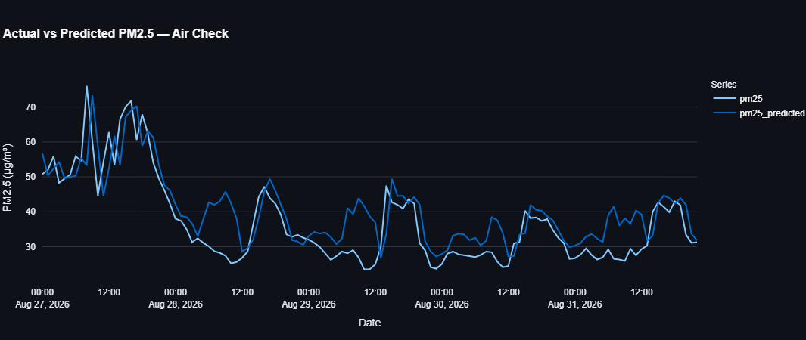
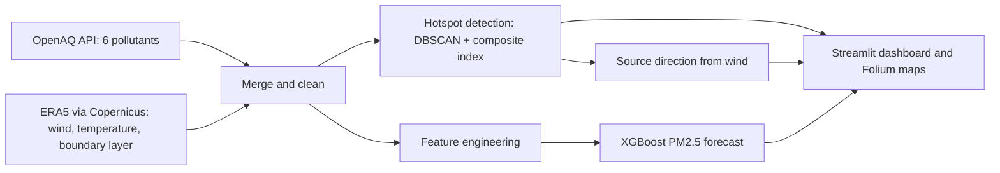

# Delhi-NCR Air Pollution: Hotspot Detection & PM2.5 Forecasting

An end-to-end data-science pipeline that downloads air-quality readings for **71 monitoring stations
across Delhi-NCR (August 2026)**, joins them with ERA5 weather data, finds pollution **hotspots**
with spatial clustering, estimates the **wind direction the pollution arrives from**, forecasts
PM2.5 with XGBoost, and presents everything in an interactive **Streamlit dashboard**.

> **Live dashboard:** _Run locally with streamlit run dashboard.py_ &nbsp;|&nbsp;
> **Screenshot:** 



## Pipeline



| Step | Script | What it does |
|------|--------|--------------|
| 1 | `src/01_fetch_openaq.py` | Downloads PM2.5, PM10, NO2, SO2, CO, O3 for every active station in the Delhi-NCR bounding box (OpenAQ v3 API, paginated, with retries) |
| 2 | `src/02_fetch_era5.py` | Downloads hourly 10 m wind, 2 m temperature and boundary-layer height from Copernicus ERA5 |
| 3 | `src/03_merge_era5.py` | Matches each reading to the nearest ERA5 grid cell and hour (vectorised xarray lookup); derives wind speed and direction |
| 4 | `src/04_detect_hotspots.py` | Composite pollution index + DBSCAN (haversine, 3 km) on station locations; clusters above the city mean are hotspots |
| 5 | `src/05_estimate_source_direction.py` | Circular-mean wind direction per hotspot cluster |
| 6 | `src/06_daily_hotspots.py` | Repeats the hotspot detection for each day so the dashboard slider is instant |
| 7 | `src/07_build_features.py` | Time features, PM2.5 lags / rolling mean per station, weather, coordinates |
| 8 | `src/08_train_forecast.py` | XGBoost with a time-based train/test split, evaluated against a naive baseline |
| 9 | `src/09_make_maps.py` | Interactive Folium maps, including a PM2.5-only vs composite-index comparison |
| 10 | `src/10_plot_forecast.py` | Actual-vs-predicted plot for a chosen station |

## Results

**Hotspots.** Stations form 10 spatial clusters (27 stations are isolated "noise"). The composite
index flags 5 clusters as hotspots and PM2.5 alone flags 7; **4 agree**, 3 are flagged only by PM2.5
(PM2.5 high, other pollutants near average) and 1 only by the composite index (NO2 and SO2 well above
average, PM2.5 below). Using more than one pollutant changes which areas look worst, so the choice of
definition matters.

**Source direction.** Most hotspots point to a south / south-south-easterly wind
(`results/hotspot_source_directions.csv`), consistent with the monsoon flow. See limitations below.

**Forecast (test set: 27-31 Aug 2026, 15,867 readings, 70 stations).**

| Model | MAE (µg/m³) | RMSE (µg/m³) | R² |
|-------|------------:|-------------:|----:|
| XGBoost | 5.57 | 11.63 | 0.750 |
| Persistence baseline (next reading = last reading) | **2.75** | **7.40** | **0.899** |

The XGBoost model **does not yet beat the trivial baseline**: the previous reading alone carries most
of the signal (`pm25_lag1` has ~71% of the feature importance) and the task is only 15 minutes
ahead. Reporting this openly is deliberate; the roadmap below lists how to turn it into a real forecast.
Full numbers: `results/model_metrics.json`. XGBoost's random subsampling differs between operating
systems, so re-running on another machine gives slightly different XGBoost numbers (about
MAE 5.4-5.6); the persistence baseline is deterministic.

## Quick start

**Just the dashboard** (uses the committed files in `results/`):

```bash
pip install -r requirements.txt
streamlit run app/dashboard.py
```

**Full pipeline** (Python 3.12):

```bash
pip install -r requirements-pipeline.txt

# 1. OpenAQ key (free): copy .env.example to .env and paste your key
# 2. Copernicus CDS: create an account, accept the ERA5 licence, put your credentials in ~/.cdsapirc
python src/run_pipeline.py              # all steps
python src/run_pipeline.py --skip-fetch # steps 3-10 only, if data/ already holds the downloads
pytest                                  # unit tests (no network or keys needed)
```

Large raw and intermediate files are written to `data/` (git-ignored); small final outputs go to
`results/` (committed), which is all the dashboard needs. The interactive maps are plain HTML files in
`results/maps/` - open them in a browser (GitHub only shows their source).

**Deploy the dashboard:** on [Streamlit Community Cloud](https://share.streamlit.io) create a new app
from this repository with main file path `app/dashboard.py`.

## Repository layout

```
app/dashboard.py        Streamlit dashboard (reads results/ only)
src/                    numbered pipeline steps + shared config.py and utils.py
tests/                  unit tests for the helpers and the mocked OpenAQ download logic
results/                small committed outputs: CSV summaries, model, predictions, maps, figures
data/                   raw + intermediate data (git-ignored, re-created by the pipeline)
```

## Limitations and next steps

- **Forecast task is too easy.** It predicts the next 15-minute reading. Next: forecast 1 h / 6 h / 24 h
  ahead, predict the *change* from the last reading, report several baselines, and use rolling-window
  cross-validation plus a station-held-out split.
- **Lags are counted in rows, not time.** Sensors have gaps (only ~68% of the 15-minute grid is
  present), so `pm25_lag96` is often much more than 24 h back. Next: reindex each station to a regular
  time grid before building lags.
- **`day_of_month` cannot generalise** in a single month (test days never appear in training); drop it.
- **One month of data, in the monsoon.** August is Delhi's cleanest season and the test set is only
  five days. Extending to Oct-Feb (the high-pollution season) would make the hotspots far more meaningful.
- **DBSCAN clusters station *locations*, not pollution values**, so clusters partly reflect where
  monitors happen to be placed, and several clusters have only 2 stations. Next: Getis-Ord Gi\* or
  Local Moran's I, or clustering only high-pollution readings.
- **Source direction is a rough indication.** It uses a monthly (or daily) mean wind that is not
  weighted by pollution level, and ERA5 has a ~28 km grid, so neighbouring clusters get almost the same
  wind (2.09-2.12 m/s for all of them). Next: pollution roses / conditional probability functions or
  HYSPLIT back-trajectories.
- **Composite index** is a min-max average of pollutants; sensor units are not cross-checked and it is
  not the official CPCB AQI. Next: use CPCB sub-index breakpoints.
- Days are split on UTC timestamps (a "day" runs 05:30-05:30 IST).
- The OpenAQ station list is fetched in a single request of up to 1,000 stations (the script warns if OpenAQ reports more).

## Data sources and attribution

- Air-quality measurements: [OpenAQ](https://openaq.org), which aggregates data from government
  monitoring agencies and other providers. Each data provider keeps its own licence and terms; please check OpenAQ's
  documentation before redistributing raw data (which is why `data/` is not committed).
- Weather: ERA5 hourly data on single levels - Hersbach, H. et al. (2023), Copernicus Climate Change
  Service (C3S) Climate Data Store, DOI: [10.24381/cds.adbb2d47](https://doi.org/10.24381/cds.adbb2d47).
  _Generated using Copernicus Climate Change Service information (2026)._

## License

MIT - see [LICENSE](LICENSE).
